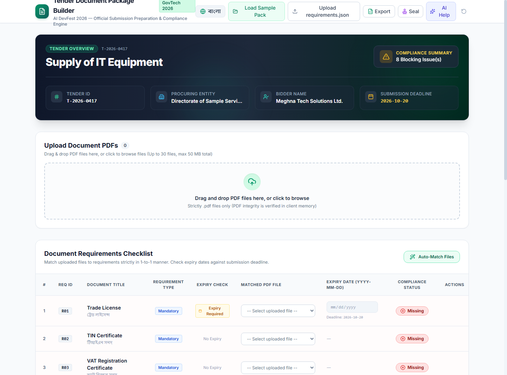
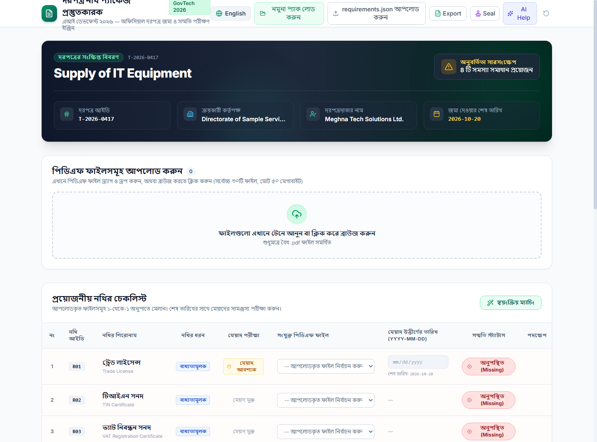
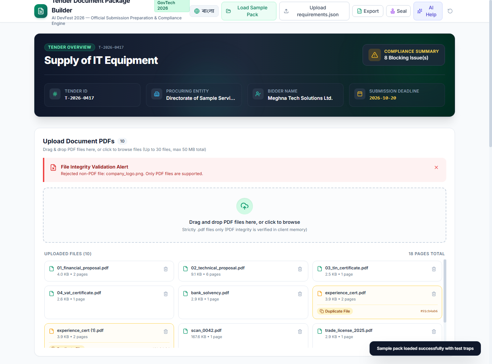
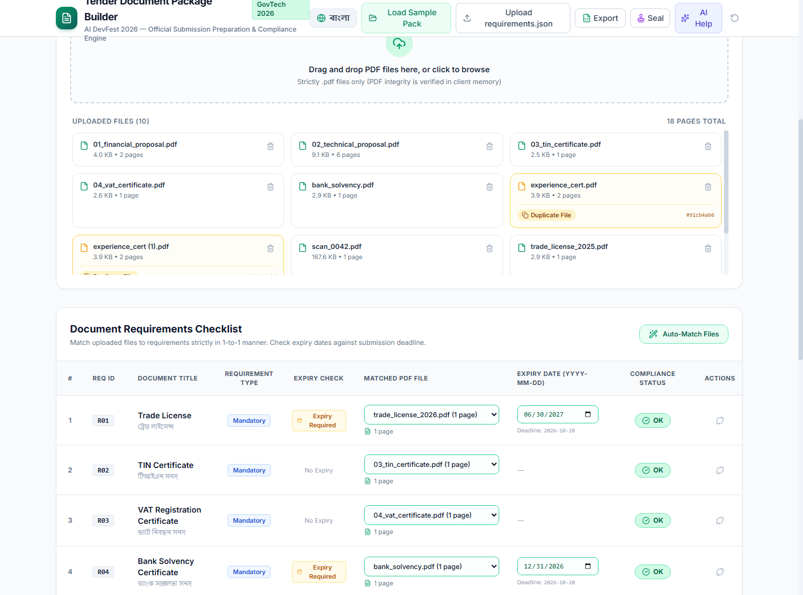

# Tender Document Package Builder (দরপত্র নথি প্যাকেজ প্রস্তুতকারক)

> **AI DevFest 2026 — AI Vibe-Coding Contest Official Submission**  
> *A 100% Client-Side, Zero-Backend, Bilingual Web Application for Preparing Compliant Tender Submissions.*

[](LICENSE)
[](https://react.dev/)
[](https://www.typescriptlang.org/)
[](https://vitejs.dev/)
[](https://tailwindcss.com/)
[](https://pdf-lib.js.org/)

---

## 🏛️ Executive Summary

In public procurement and enterprise bidding, bid preparation is traditionally error-prone. Bids are routinely disqualified due to missing mandatory documents, expired licenses, duplicate file attachments, or mismatched document sequences.

**Tender Document Package Builder** is a production-grade, GovTech-compliant web application designed to eliminate these failure modes entirely. The application runs **100% inside the user's browser** with zero participant-controlled backend servers, zero database dependencies, and zero secrets.

---

## 📸 Screenshots & Status Progression

| 1. Initial Missing State (Blocking) | 2. Bilingual Bangla Mode (বাংলা) |
| :---: | :---: |
|  |  |

| 3. Traps Detected (Non-PDF Rejected, Duplicates Flagged) | 4. Scrolled Checklist & Verified OK (Ready) |
| :---: | :---: |
|  |  |

---

## 🛡️ Contest Compliance Matrix

| Rulebook Section | Requirement | Compliance Implementation |
| :--- | :--- | :--- |
| **Rule 5.1** | **Frontend Only** | 100% in-browser execution. All PDF operations, cryptographic hashing, and status evaluations happen in client memory via `pdf-lib` and Web Crypto API. |
| **Rule 5.8** | **Zero Secrets** | No API keys, tokens, or credentials are hardcoded or committed. Optional AI assistance uses Bring-Your-Own-Key (BYOK) stored exclusively in transient session memory. |
| **Rule 5.6 & 4.9** | **Dual Language** | Instantaneous switching between **English** and **Bangla (বাংলা)**. Dynamic document titles (`title_en` / `title_bn`), status badges, error banners, and tooltips are fully localized. |
| **Rule 8.1 / 9.2** | **Open Source** | Licensed under the permissive **MIT License** with valid `LICENSE` and complete documentation. |
| **Problem Sec 9** | **Required Artifacts** | Verified `output/T-2026-0417_Package.pdf` (exact 16 pages) and `screenshots/` directory included in repository. |

---

## 🧩 Deep Dive: Sample Pack Hidden Traps & Solutions

| File / Item | Problem Trait | App Detection & Handling | Result |
| :--- | :--- | :--- | :--- |
| `company_logo.png` | **Non-PDF file** | Upload zone inspects file MIME and extension. Non-PDF files are instantly rejected with an explicit alert banner: *"Rejected non-PDF file: company_logo.png. Only PDF files are supported."* | **PASS** |
| `experience_cert.pdf` & `experience_cert (1).pdf` | **Exact duplicate files** | Web Crypto computes SHA-256 (`#91cb4ab6`). Both files are tagged with yellow warning badges. If one file is assigned to a requirement, the duplicate is strictly disabled from selection. | **PASS** |
| `trade_license_2025.pdf` | **Expired license** (`2025-06-30`) | When matched to R01, expiry date `2025-06-30` is before submission deadline `2026-10-20`. Status evaluates to **"Expired"** (Red) and blocks generation. | **PASS** |
| `trade_license_2026.pdf` | **Valid license** (`2027-06-30`) | Expiry date `2027-06-30` is after deadline `2026-10-20`. Status evaluates to **"OK"** (Green). | **PASS** |
| `bank_solvency.pdf` | **Expiry date needed** | Matched to R04 (`has_expiry: true`). Until date is entered, status shows **"Expiry date needed"** (Amber). When `2026-12-31` is entered, status resolves to **"OK"**. | **PASS** |
| `scan_0042.pdf` | **Scanned image PDF** | Non-descriptive filename containing scanned declaration. Office staff can inspect preview and assign to R10 (Signed Declaration). | **PASS** |
| `R06` & `R07` | **Optional documents** | Unmatched optional documents show **"Not provided"** (Gray). This does NOT block package generation. | **PASS** |
| Boundary Equality | **Same-day expiry** | If document expiry equals submission deadline (`2026-10-20`), rule states: *"If a document expires on the same day as the submission deadline, it is still OK."* Status evaluates as **OK**. | **PASS** |

---

## 📄 Package Construction Rules (Section 6)

1. **Page 1 — Cover Page (English only)**:
   - Header with professional accent bar.
   - Tender metadata table: Tender ID (`T-2026-0417`), Title, Procuring Entity, Bidder, Deadline, Creation Date.
   - Sequence of Included Documents: `#`, `Req ID`, `Document Title`, `Matched File`, `Pages`.
2. **Sequential Document Merging**:
   - Documents are merged strictly by `order` (1 to 10).
   - All original pages of each matched PDF are included in order.
   - Optional documents without matched files are omitted from the package.
3. **Universal Footer on Every Page**:
   - Footer format: `<tender_id> | Page X of Y` (e.g. `T-2026-0417 | Page 1 of 16`).
   - Centered, Helvetica font, 16pt above bottom margin to ensure zero text obstruction.
4. **Auto-Download**:
   - Triggers clean browser download as `T-2026-0417_Package.pdf`.
   - Sample pack package page count: **Exactly 16 pages** (1 Cover + 15 Document Pages).

---

## ⭐ Bonus Features Implemented (Section 7)

- **Index / Table of Contents Page**: Toggleable bonus page inserted immediately after cover page showing start page numbers.
- **PNG Seal & Signature Stamper**: Upload company seal/signature PNG and configure target placement (All pages, First & Last, Bottom-Right, Bottom-Left).
- **Checklist Export**: 1-click export of the live requirements checklist as **CSV** or Excel (**XLSX**).
- **Session State Persistence**: Auto-save to `localStorage` + JSON project state export and import.
- **Intelligent Auto-Match**: Fuzzy keyword matching links filenames (e.g. `tin`, `vat`, `bank`, `technical`, `financial`, `scan`) to requirements.
- **Client-Side AI Assistant (BYOK)**: Optional modal allowing users to enter a Google Gemini or OpenAI API key for OCR assistance with zero server exposure.

---

## 🚀 Quickstart & Verification Instructions

### Prerequisites
- Node.js `v18+` (Tested on Node `v24.15.0`)
- Modern web browser (Google Chrome recommended)

### 1. Installation
```bash
git clone <repository-url>
cd tender-document-package-builder
npm install
```

### 2. Development Server
```bash
npm run dev
```
Open [http://localhost:5173](http://localhost:5173) in Google Chrome.

### 3. Production Build & Preview
```bash
npm run build
npm run preview
```
Open [http://localhost:4173](http://localhost:4173).

### 4. Headless Automated Verification & PDF Generation
To reproduce the verified 16-page sample pack package:
```bash
node scripts/generate_sample_package.mjs
```
The verified package will be written to `output/T-2026-0417_Package.pdf`.

---

## 🧪 Verification Test Cases Matrix

| Test ID | Test Description | Action | Expected Output | Status |
| :---: | :--- | :--- | :--- | :---: |
| **TC-01** | Load `requirements.json` | Click "Upload requirements.json" or "Load Sample Pack" | Header displays tender ID, bidder, deadline; 10 requirements displayed sorted by order 1-10. | **PASS** |
| **TC-02** | Reject non-PDF upload | Upload `company_logo.png` | File rejected; alert banner shows: "Rejected non-PDF file: company_logo.png. Only PDF files are supported." | **PASS** |
| **TC-03** | Detect exact duplicates | Upload `experience_cert.pdf` & `experience_cert (1).pdf` | Both files tagged with yellow "Duplicate File #91cb4ab6" badge. Dropdown blocks duplicate assignment. | **PASS** |
| **TC-04** | Initial Blocking Status | Unmatched mandatory items | Mandatory rows show "Missing" (Red). Generate button disabled with blocking issue count. | **PASS** |
| **TC-05** | Expired Document Handling | Match `trade_license_2025.pdf` with `2025-06-30` | Status changes to "Expired" (Red). Generate button remains disabled. | **PASS** |
| **TC-06** | Expiry Date Needed State | Match `trade_license_2026.pdf` without date | Status changes to "Expiry date needed" (Amber). Generate button disabled. | **PASS** |
| **TC-07** | Boundary Date Equality | Enter expiry date `2026-10-20` (same as deadline) | Status changes to "OK" (Green). Boundary rule confirmed. | **PASS** |
| **TC-08** | Optional Docs Handling | Leave R06 and R07 unmatched | Status shows "Not provided" (Gray). Generate button is NOT blocked. | **PASS** |
| **TC-09** | Valid Package Generation | Match all 8 required files correctly | All mandatory items show "OK". Generate button glows active. | **PASS** |
| **TC-10** | Cover Page & Page Count | Verify generated package PDF | Page 1 is Cover Page (in English); Total package pages = exactly 16 pages. | **PASS** |
| **TC-11** | Universal Footer | Inspect every page bottom | `<tender_id> | Page X of 16` centered, clean Helvetica, does not overlap content. | **PASS** |
| **TC-12** | Bilingual Toggle | Click language button (English ↔ বাংলা) | All labels, badges, columns, and document titles switch instantaneously. | **PASS** |
| **TC-13** | Auto-Match Suggestion | Click "Auto-Match Files" | Files matching keywords automatically link to corresponding requirements. | **PASS** |
| **TC-14** | CSV / Excel Export | Click "Export Checklist (CSV / Excel)" | Downloads structured checklist with all metadata and compliance statuses. | **PASS** |

---

## 📜 License

Distributed under the **MIT License**. See [`LICENSE`](LICENSE) for more information.
